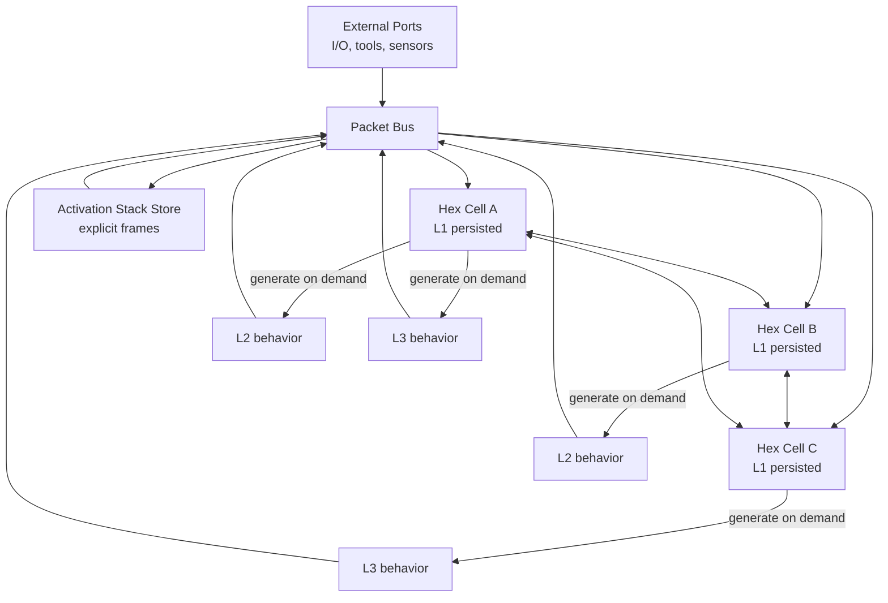

# Architecture Specification

Related specs: [runtime](runtime.md), [activation store](activation-store.md), [training bootstrap](training-bootstrap.md), [research synthesis](research-synthesis.md), [open questions](open-questions.md), [glossary](glossary.md), [bibliography](bibliography.md).

## Overview
Metaphemeral Network is modeled as a fixed-address hex lattice of compute cells. Each cell holds persistent L1 state and can generate short-lived L2/L3 behaviors during execution. The architecture is message-driven: packets move across the lattice and trigger local expert execution.

- **Project synthesis:** fixed hex lattice, only-L1-persists rule, activation stack store, and two-plane scheduler.
- **Paper-backed component:** use of tiny sparse experts and dynamic routing patterns is informed by sparse-MoE work (see bibliography group “Sparse experts / routing”).
- **Open question:** exact parameterization and scaling law for the generated behavior stack.

## Design principles
1. Persistent memory should be minimal and local (L1 per address).
2. Most computation should be generated contextually and then discarded.
3. Scheduling should be sparse and pressure-aware, not globally synchronous dense execution.
4. Message traces should be explicit and inspectable for debugging.
5. Novel design elements must be labeled as project synthesis.

## Stable substrate ("physics layer")
The stable runtime substrate defines what cannot change during ordinary execution:
- Address space topology (hex lattice indices and neighbors).
- Packet transport semantics.
- Activation stack store interface.
- L1 persistence and commit boundaries.
- Reflex/deliberation scheduler interfaces.

**Project synthesis:** this substrate is repo-specific and not claimed as a standard architecture.

## Persisted state model (only L1 persists)
Each lattice address owns one durable L1 state object. L1 is the only model state that survives beyond commit boundaries.

L1 contains, at minimum:
- local adapter weights or latent-coded weight seeds,
- routing priors/capability descriptors,
- bounded control metadata (health, pressure thresholds, cooldown timers),
- optional lineage metadata for reproducibility.

L2 and L3 states are generated from L1 + current activation context and are discarded unless distilled back into L1 during commit.

**Open question:** canonical representation of L1 across different expert families.

## Universal Expert Node
A lattice cell is treated as a universal expert node with one persistent anchor (L1) and multiple generated execution forms (L2/L3). The same address can express different behavior classes depending on incoming packets, scheduler plane, and local activation pressure.

**Project synthesis:** this role-unification is a design choice for this repo.

## L1 / L2 / L3 as behaviors rather than fixed modules
- **L1 behavior:** persistent policy and adaptation anchor.
- **L2 behavior:** fast local response routines (e.g., refinement, routing arbitration, compression/decompression).
- **L3 behavior:** deeper multi-step synthesis/planning routines, invoked selectively.

These are behavioral levels, not hard-coded module classes.

## Fixed hex address lattice
The runtime uses fixed addresses with hex-neighborhood adjacency for local routing primitives.

Why hex:
- consistent bounded degree for local traffic,
- straightforward neighbor-based propagation,
- clean mapping for sparse activation fronts.

**Project synthesis:** no claim that hex is globally optimal; it is chosen for controllable locality and simulator simplicity.

## Implicit links via packet traffic
There are no static learned edges in the substrate graph beyond lattice adjacency and explicit addressing. Functional links are induced by repeated packet exchange patterns and capability beacons.

- **Project synthesis:** traffic-defined connectivity semantics.
- **Open question:** when and how recurring routes should influence long-term L1 routing priors.

## Tiny sparse experts and dynamic routing
The architecture assumes many tiny experts and sparse selection per event.

- **Paper-backed component:** sparse expert scaling patterns and routing methods are motivated by PEER, Sigma-MoE-Tiny, and DirMoE (see [bibliography](bibliography.md#sparse-experts--routing)).
- **Project synthesis:** embedding those ideas into a fixed-lattice, L1-persistent runtime.

## Executor options
Execution backends for generated L2/L3 routines are intentionally modular.

### Few-step flow-based language executor
- **Paper-backed component:** motivated by flow-based/continuous denoising generation results (see [bibliography](bibliography.md#executor-options--few-step-generation)).
- Intended use: low-latency deliberation bursts where limited iterative depth is acceptable.

### Block diffusion language executor
- **Paper-backed component:** motivated by token-edit diffusion style executors (see [bibliography](bibliography.md#executor-options--few-step-generation)).
- Intended use: iterative correction loops where controllability matters more than single-step speed.

**Open question:** unified executor interface that preserves traceability across both options.

## Paper-backed components
- Sparse expert/routing families for conditional compute.
- Few-step flow/diffusion executor ideas.
- Supporting references for adaptation, workspace, and adaptive compute in [bibliography](bibliography.md).

## Project synthesis components
- Fixed hex lattice as execution substrate.
- Strict only-L1-persists persistence rule.
- Activation stack store with handle-based frame flow.
- Reflex/deliberation two-plane scheduler integrated with packet routing.

## Mermaid system diagram

