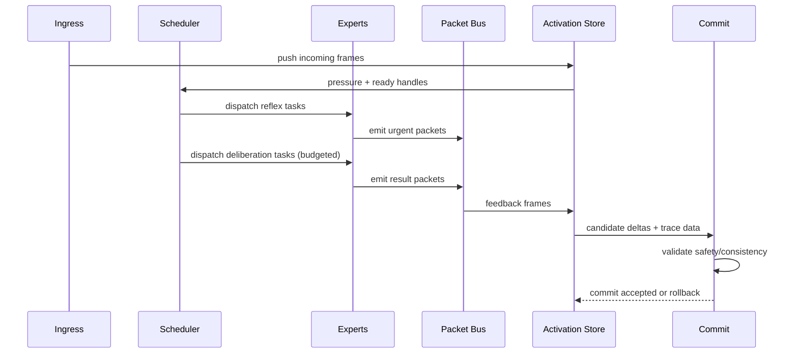

# Runtime Specification

Related specs: [architecture](architecture.md), [activation store](activation-store.md), [l1 schema](l1-schema.md), [tick trace](tick-trace.md), [training bootstrap](training-bootstrap.md), [open questions](open-questions.md), [glossary](glossary.md), [bibliography](bibliography.md).

## Compute model
Runtime execution is event-driven over a fixed-address lattice. Each tick consumes ingress packets and local activation pressure, schedules sparse expert execution, emits new packets, and commits L1 updates.

- **Project synthesis:** tick semantics and scheduler design are specific to this repo.
- **Paper-backed component:** adaptive compute and selective execution motivation comes from conditional/sparse computation literature listed in [bibliography](bibliography.md).

## Tick / cycle semantics
A tick is one bounded cycle with these phases:
1. Ingress capture and packet normalization.
2. Activation-store update (push incoming frames).
3. Plane scheduling (reflex first, then deliberation budget).
4. Expert execution and packet emission.
5. Feedback integration and optional escalation.
6. Commit or rollback for L1 deltas.

Ticks are globally indexed for observability, but computation remains locally sparse.

## Two-plane scheduler
### Reflex plane
Fast path for immediate, bounded-latency handling.
- Handles interrupts, safety checks, and direct response policies.
- Uses strict compute/time caps.
- May emit high-priority packets or trigger escalation.

### Deliberation plane
Slower path for deeper generated routines.
- Runs only when budget remains after reflex tasks.
- Can execute multi-step L2/L3 routines.
- Produces proposals that may be accepted, deferred, or dropped.

**Project synthesis:** two-plane partition is architectural policy, not a direct paper import.

## Packet routing modes
### Neighbor routing
Default local propagation to one or more hex-adjacent addresses.
- Good for diffusion-like local coordination.
- Naturally bounded by neighborhood degree.

### Explicit address routing
Packet targets specific destination address(es).
- Used for directed service calls or known specialist addresses.

### Group/capability routing
Packet targets a capability label instead of concrete address.
- Runtime resolves recipients by current beacons/routing priors.
- Resolution uses deterministic candidate ranking with bounded randomized fallback.

- **Project synthesis:** the following collision and fairness rules are simulator defaults.

#### Capability collision-resolution semantics
For each capability-routed packet:
1. Build candidate set from addresses with unexpired capability beacons.
2. Score each candidate with:
   - `score = beacon_weight * capability_match * freshness_factor * load_penalty`.
3. Select recipients with a hybrid policy:
   - pick top `k_primary` by score,
   - sample up to `k_explore` additional candidates from the remaining top `explore_window` using score-proportional randomization.
4. De-duplicate recipients and enforce per-packet `max_recipients`.

Tie-break order for equal score: smaller `last_assigned_tick`, then lexicographically smaller address id.

#### Fairness and starvation guardrails
To avoid repeated high fan-in starving less frequent experts:
- Track `consecutive_skips` per capability candidate.
- If `consecutive_skips >= starvation_threshold`, candidate receives temporary `fairness_boost` multiplier until selected.
- Enforce `max_assignments_per_tick` per destination for capability traffic.
- If all candidates are throttled, emit `capability_backpressure` and retry next tick.

#### Beacon refresh/decay and observability fields
Capability beacons use stepwise decay:
- On refresh: set `beacon_epoch = current_tick` and `beacon_strength = 1.0`.
- Every `beacon_decay_interval_ticks`, apply `beacon_strength *= beacon_decay_factor`.
- Beacon expires when `beacon_strength < beacon_expiry_threshold`.

Required per-candidate observability fields:
- `beacon_epoch`, `beacon_strength`, `last_refresh_tick`,
- `last_assigned_tick`, `consecutive_skips`,
- `throttle_state` and current token-bucket balance.

#### Routing policy examples by mode
1. Neighbor traffic (local diffusion)
   - Scenario: low-priority context sharing to adjacent addresses.
   - Policy: send to all neighbors while `neighbor` bucket has tokens; if depleted, coalesce payload and defer.
2. Explicit traffic (direct service call)
   - Scenario: reply packet to a known specialist address from prior trace.
   - Policy: reserve explicit bucket budget for replies before new deliberation emissions.
3. Capability traffic (elastic discovery)
   - Scenario: packet tagged `capability=temporal-repair` with no fixed destination.
   - Policy: apply hybrid `k_primary + k_explore` recipient selection and fairness boost rules under high fan-in.

## Interrupts, escalation, and reflex triggers
Interrupt sources include:
- overflow risk in activation store,
- safety policy violations,
- external priority ingress,
- repeated failed deliberation attempts.

Escalation path:
1. reflex handler classifies trigger,
2. optional throttling/quarantine packet emission,
3. optional deliberation request with elevated priority,
4. post-action cooldown update in L1 metadata.

## Admission and throttling with depleted token buckets
- **Project synthesis:** admission rules align routing behavior with local backpressure policy.

For each outbound packet attempt:
1. Identify route bucket (`neighbor`, `explicit`, or `capability`).
2. If bucket has sufficient tokens, admit and deduct cost.
3. If insufficient tokens:
   - admit only if packet is reflex-critical and `emergency_reserve` tokens remain,
   - otherwise defer packet and increment `throttle_count`.
4. If `throttle_count` exceeds `throttle_escalation_threshold`, emit overflow/backpressure signal to reflex plane.

Defer queue policy:
- Priority order: reflex-critical > safety > explicit reply > deliberation.
- Deferred packets older than `defer_ttl_ticks` are dropped with reason `throttle_expiry`.

## State update and commit
During a tick, experts work on transient deltas. Durable change occurs only at commit:
- Merge accepted deltas into local L1 state.
- Stamp commit metadata (tick id, trace summary hash).
- Clear or age transient frames per policy.

If commit criteria fail, discard deltas and preserve prior L1 snapshot.

## Safety / rollback rules
Rollback is required when:
- validation checks fail,
- resource guardrails are exceeded,
- trace consistency is broken,
- required dependencies for a delta are missing.

Rollback guarantees:
- previous L1 snapshot remains intact,
- failed trace id is marked,
- retry policy is delegated to scheduler.

**Open question:** whether rollback should include selective partial-accept mode.

## Executor evaluation protocol (v0 simulator milestone)
- **Project synthesis:** this protocol defines how to compare flow-based and block-diffusion executors under shared tasks and observability constraints.

### Shared benchmark task set
Both executor families must run the same tasks:
1. **Reflex correction task**
   - Input: safety-sensitive packet with malformed route metadata.
   - Goal: emit corrected urgent packet within reflex budget.
2. **Deliberation reroute task**
   - Input: bursty fan-in causing capability contention.
   - Goal: propose stable reroute delta without violating fairness guardrails.
3. **Rollback recovery task**
   - Input: deliberation proposal with synthetic dependency gap.
   - Goal: produce trace that cleanly rolls back and recovers next tick.
4. **Mixed-load continuity task**
   - Input: alternating sparse and bursty traffic over a fixed horizon.
   - Goal: maintain bounded latency while preserving trace clarity.

### Mandatory metrics
For every run, record:
- `latency_ms_p50`, `latency_ms_p95` per task,
- `trace_clarity_score` (fraction of ticks with complete required metadata from [tick trace](tick-trace.md)),
- `correction_stability` (fraction of post-correction ticks that avoid repeated same-class failure within `N_stability` ticks),
- `rollback_rate` (rolled-back commits / total commit attempts).

### Acceptable operating envelopes by plane
Reflex envelope:
- p95 latency must remain within the configured reflex budget.
- rollback rate should stay below `reflex_rollback_ceiling` for safety-class tasks.

Deliberation envelope:
- p95 latency may exceed reflex budget but must remain below deliberation budget.
- correction stability must exceed `deliberation_stability_floor` on reroute and mixed-load tasks.

### Decision rule: preferred executor selection
1. Disqualify any executor that violates reflex envelope on reflex correction task.
2. Among qualified executors, rank by:
   - lower rollback rate,
   - higher trace clarity score,
   - lower p95 latency on mixed-load continuity.
3. If rankings are within tie margin `epsilon_tie`, keep both behind a runtime feature flag and mark outcome as unresolved in [open questions](open-questions.md).

### Validation artifact requirements
Each benchmark run must produce:
- task configuration file,
- aggregated metric table,
- sample trace bundle containing at least one accepted and one rolled-back commit.

See [tick-trace.md](tick-trace.md) for a canonical record shape and one-tick worked example.

## Full compute-cycle walkthrough (plain English)
A tick starts when packets arrive from external ports and neighboring cells. The runtime records these packets as activation frames and measures local pressure. The reflex plane runs first to handle urgent work quickly and enforce safety constraints. If budget remains, the deliberation plane generates and executes deeper L2/L3 routines. Both planes can emit packets, request capability-based routing, or update transient deltas.

Before finishing the tick, feedback packets and execution outcomes are consolidated. The runtime then validates proposed L1 updates. If checks pass, it commits those updates and records trace metadata. If checks fail, it rolls back to the pre-tick L1 snapshot and marks the trace for inspection. The next tick repeats with updated pressure and ingress conditions.

## Mermaid sequence diagram (one tick)

