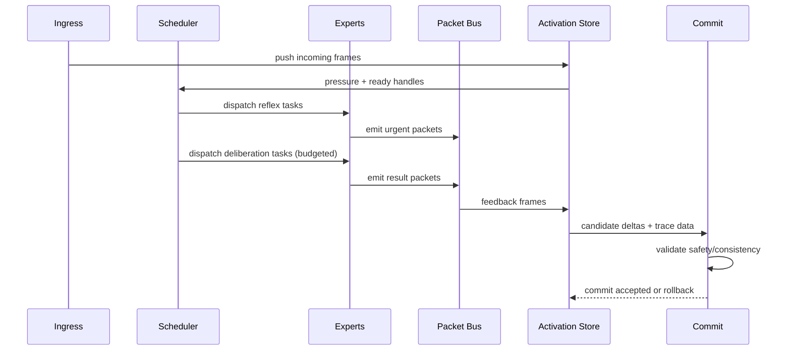

# Runtime Specification

Related specs: [architecture](architecture.md), [activation store](activation-store.md), [l1 schema](l1-schema.md), [tick trace](tick-trace.md), [training bootstrap](training-bootstrap.md), [open questions](open-questions.md), [glossary](glossary.md), [bibliography](bibliography.md).

## Compute model
Runtime execution is event-driven over a fixed-address lattice. Each tick consumes ingress packets and local activation pressure, schedules sparse expert execution, emits new packets, and commits L1 updates.

- **Project synthesis:** tick semantics and scheduler design are specific to this repo.
- **Paper-backed component:** adaptive compute and selective execution motivation comes from conditional/sparse computation literature listed in [bibliography](bibliography.md).

## Tick / cycle semantics
A tick is one bounded cycle with these phases:
1. Ingress capture and packet normalization.
2. Activation-store update (push incoming frames).
3. Plane scheduling (reflex first, then deliberation budget).
4. Expert execution and packet emission.
5. Feedback integration and optional escalation.
6. Commit or rollback for L1 deltas.

Ticks are globally indexed for observability, but computation remains locally sparse.

## Two-plane scheduler
### Reflex plane
Fast path for immediate, bounded-latency handling.
- Handles interrupts, safety checks, and direct response policies.
- Uses strict compute/time caps.
- May emit high-priority packets or trigger escalation.

### Deliberation plane
Slower path for deeper generated routines.
- Runs only when budget remains after reflex tasks.
- Can execute multi-step L2/L3 routines.
- Produces proposals that may be accepted, deferred, or dropped.

**Project synthesis:** two-plane partition is architectural policy, not a direct paper import.

## Packet routing modes
### Neighbor routing
Default local propagation to one or more hex-adjacent addresses.
- Good for diffusion-like local coordination.
- Naturally bounded by neighborhood degree.

### Explicit address routing
Packet targets specific destination address(es).
- Used for directed service calls or known specialist addresses.

### Group/capability routing
Packet targets a capability label instead of concrete address.
- Runtime resolves recipients by current beacons/routing priors.
- Resolution may be probabilistic or top-k constrained.

**Open question:** stable semantics for capability resolution under heavy load.

## Interrupts, escalation, and reflex triggers
Interrupt sources include:
- overflow risk in activation store,
- safety policy violations,
- external priority ingress,
- repeated failed deliberation attempts.

Escalation path:
1. reflex handler classifies trigger,
2. optional throttling/quarantine packet emission,
3. optional deliberation request with elevated priority,
4. post-action cooldown update in L1 metadata.

## State update and commit
During a tick, experts work on transient deltas. Durable change occurs only at commit:
- Merge accepted deltas into local L1 state.
- Stamp commit metadata (tick id, trace summary hash).
- Clear or age transient frames per policy.

If commit criteria fail, discard deltas and preserve prior L1 snapshot.

## Safety / rollback rules
Rollback is required when:
- validation checks fail,
- resource guardrails are exceeded,
- trace consistency is broken,
- required dependencies for a delta are missing.

Rollback guarantees:
- previous L1 snapshot remains intact,
- failed trace id is marked,
- retry policy is delegated to scheduler.

**Open question:** whether rollback should include selective partial-accept mode.

See [tick-trace.md](tick-trace.md) for a canonical record shape and one-tick worked example.

## Full compute-cycle walkthrough (plain English)
A tick starts when packets arrive from external ports and neighboring cells. The runtime records these packets as activation frames and measures local pressure. The reflex plane runs first to handle urgent work quickly and enforce safety constraints. If budget remains, the deliberation plane generates and executes deeper L2/L3 routines. Both planes can emit packets, request capability-based routing, or update transient deltas.

Before finishing the tick, feedback packets and execution outcomes are consolidated. The runtime then validates proposed L1 updates. If checks pass, it commits those updates and records trace metadata. If checks fail, it rolls back to the pre-tick L1 snapshot and marks the trace for inspection. The next tick repeats with updated pressure and ingress conditions.

## Mermaid sequence diagram (one tick)

